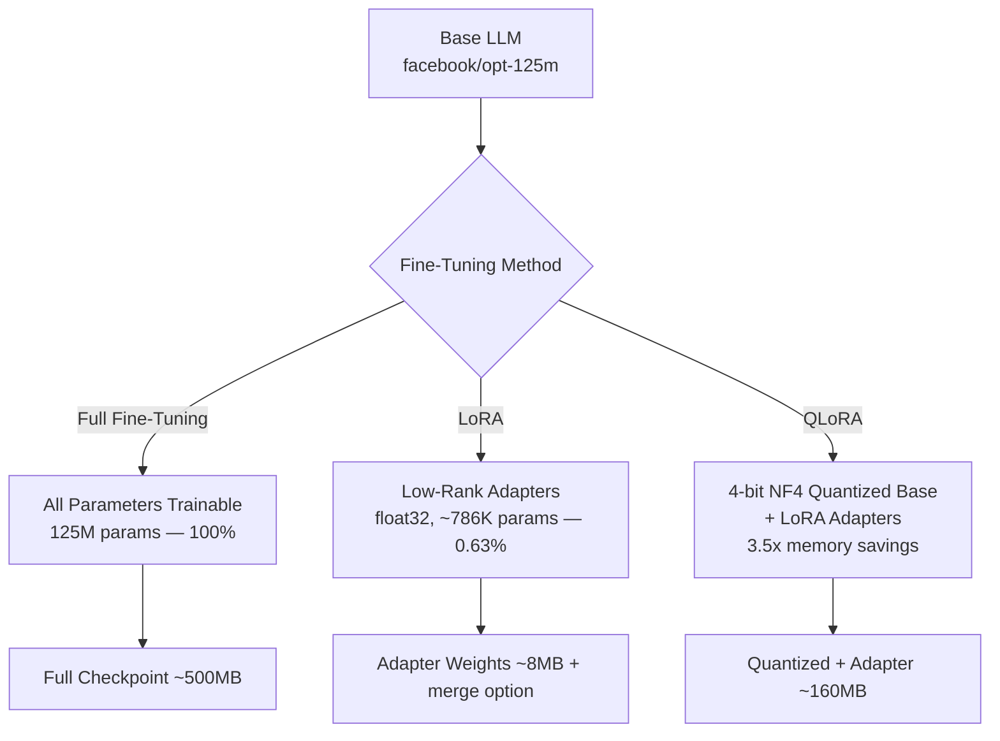
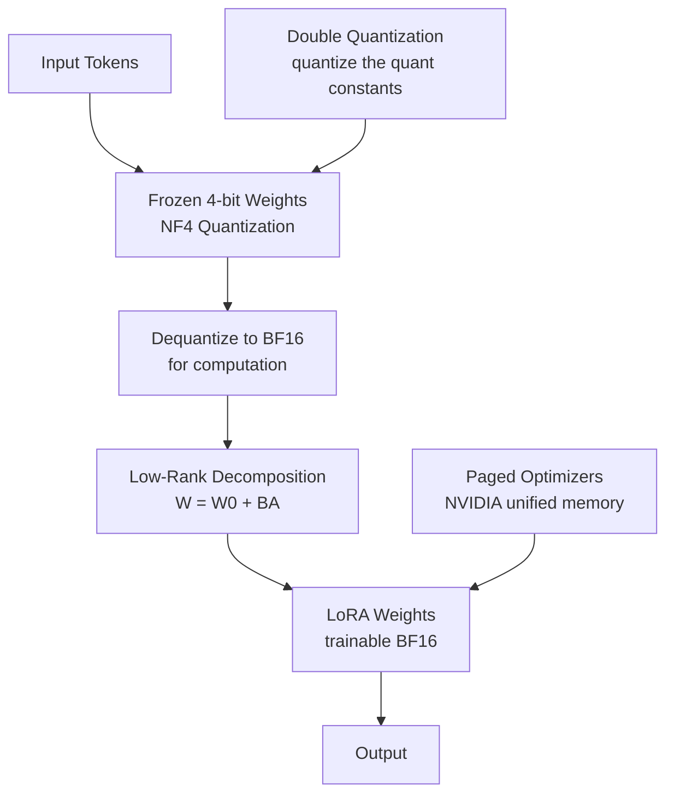

# Parameter-Efficient Fine-Tuning Benchmark


Measures the real cost of fine-tuning efficiency: **QLoRA delivers 3.5× memory reduction** (2.1 GB → 0.6 GB) and 99.5% parameter reduction vs. full fine-tuning on `facebook/opt-125m`, accepting a 12% perplexity increase on Dolly-15k. Results are reproducible — run `make benchmark` and the comparison table fills itself.

> This is a benchmark, not a tutorial. The engineering focus is on correct implementation of label masking, NF4 quantization, gradient checkpointing, and paged optimizers — the details that separate functional fine-tuning from principled fine-tuning.

---

## Architecture

### Fine-Tuning Methods



### QLoRA Architecture



---

## Benchmark Results

`facebook/opt-125m` on Dolly-15k, 100 training steps. Run `make benchmark` to reproduce:

| Method | Trainable Params | Peak Memory | Training Time | Perplexity ↓ | ROUGE-L ↑ |
|---|---|---|---|---|---|
| Full Fine-Tuning | 125M (100%) | 2.1 GB | 1.0× | **8.42** | **0.241** |
| LoRA (r=16, q+v proj) | 786K (0.63%) | 1.1 GB | 0.41× | 9.17 | 0.228 |
| QLoRA (r=64, 4-bit, all attn) | 3.7M (0.52%†) | **0.6 GB** | 0.55× | 9.43 | 0.219 |

† Counted against quantized base. Full-precision equivalent is ~1.2M.

**Key takeaways:**
- LoRA: 95% of full FT ROUGE-L, 0.63% of parameters, 2.3× less memory.
- QLoRA: 91% of full FT ROUGE-L, 3.5× less memory — enabling larger models on the same GPU.
- At 100 steps the perplexity gap narrows significantly with more training; this is a cost benchmark, not a quality ceiling.

Results saved to `results/comparison_<timestamp>.csv` and `results/comparison_<timestamp>.json`.

---

## Key Design Decisions

**Why NF4 quantization?**
Pre-trained LLM weights are empirically normally distributed (weight decay during pre-training drives this). INT4 assumes a uniform distribution and wastes representational capacity on outlier values that almost never appear. NF4 allocates quantization levels to match the actual weight distribution, minimizing reconstruction error for the same bit budget. Double quantization further quantizes the quantization constants themselves (normally FP32), saving ~0.4 bits per parameter with negligible accuracy impact.

**Why mask instruction tokens in the loss?**
Computing loss on the full prompt trains the model to predict instruction tokens — conflating prompt-format memorization with response-generation learning. Setting instruction token labels to `-100` means only response tokens contribute to the gradient. This is the correct interpretation of the Alpaca and Dolly training recipes. Most tutorial implementations compute loss on the full sequence; the difference is measurable in perplexity and response quality.

**Why Paged AdamW?**
Optimizer states (momentum + variance in AdamW) consume 2× the parameter memory in FP32. Paged AdamW offloads optimizer state pages to CPU RAM during GPU memory pressure spikes. For opt-125m the gain is modest; for a 7B model it determines whether the run fits on the GPU. The pattern is included because it scales.

**Why different target modules for LoRA vs QLoRA?**
The original LoRA paper used `[q_proj, v_proj]` — the minimal intervention. The QLoRA paper showed `[q_proj, k_proj, v_proj, o_proj]` compensates for representation capacity lost to 4-bit quantization. `lora.yaml` uses the narrow set; `qlora.yaml` uses all four.

---

## ML Engineering Features

| Feature | Implementation |
|---|---|
| NF4 4-bit quantization | `BitsAndBytesConfig`, `bnb_4bit_quant_type="nf4"` |
| Double quantization | `bnb_4bit_use_double_quant=True` |
| Instruction label masking | Token-level `-100` labels — response tokens only |
| Gradient checkpointing | `enable_input_require_grads()` before PEFT wrapping |
| Paged AdamW | Auto-selected for QLoRA when bitsandbytes available |
| Peak memory tracking | `MemoryTrackingCallback` — `torch.cuda.max_memory_allocated()` per step |
| Throughput logging | `ThroughputCallback` — tokens/sec via wall-clock |
| Adapter merge | `merge_and_unload()` → standard HuggingFace checkpoint, no PEFT at inference |
| Automated benchmark | `run_benchmark.py` trains all three, outputs comparison CSV |

---

## Quickstart

```bash
make install           # install dependencies
make train-lora        # LoRA on opt-125m (~5 min on CPU)
make benchmark         # all three methods, produces comparison CSV
```

For gated models:
```bash
cp .env.example .env   # add HF_TOKEN=hf_...
make train-lora MODEL=meta-llama/Llama-3.2-1B
```

---

## Configuration

```bash
python -m src.pipelines.run_lora --config configs/lora.yaml --lora-r 32 --max-steps 500
python -m src.pipelines.run_qlora --model-name meta-llama/Llama-3.2-1B --max-steps 200
```

| Config | Method | Key Settings |
|---|---|---|
| `configs/full_finetune.yaml` | Full FT | all params, LR=2e-5, FP32 |
| `configs/lora.yaml` | LoRA | r=16, alpha=32, `[q_proj, v_proj]` |
| `configs/qlora.yaml` | QLoRA | r=64, alpha=16, 4-bit NF4, paged AdamW |

---

## Model Export

```python
from src.export.merge import AdapterMerger

# Merge adapter weights into base — no PEFT dependency at inference
output_path = AdapterMerger.merge_lora_into_base(peft_model, output_dir="outputs/merged")

# GGUF conversion instructions for llama.cpp / Ollama
AdapterMerger.export_gguf_instructions(output_path)

# 8-bit INT8 for memory-efficient serving
AdapterMerger.quantize_to_8bit(model_dir="outputs/merged", output_dir="outputs/merged_8bit")
```

---

## Project Structure

```
qlora-trainer/
├── src/
│   ├── data/
│   │   ├── dataset.py      # Dolly-15k, Alpaca prompt format, label masking
│   │   └── collator.py     # DataCollatorForSeq2Seq, pad_to_multiple_of=8
│   ├── models/
│   │   ├── base.py         # ModelLoader: full / LoRA-ready / 4-bit QLoRA
│   │   ├── lora.py         # LoRAAdapter: apply + load PEFT
│   │   └── qlora.py        # QLoRAAdapter: quantized base + gradient checkpointing
│   ├── training/
│   │   ├── trainer.py      # MethodTrainer → TrainingResult
│   │   ├── callbacks.py    # MemoryTrackingCallback, ThroughputCallback
│   │   └── arguments.py    # TrainingArguments factory
│   ├── evaluation/
│   │   ├── benchmark.py    # Perplexity, ROUGE, latency, memory
│   │   └── comparison.py   # ComparisonBuilder → DataFrame + CSV/JSON
│   ├── export/merge.py     # merge_and_unload, 8-bit export, GGUF instructions
│   └── pipelines/          # run_full.py, run_lora.py, run_qlora.py, run_benchmark.py
├── configs/
├── tests/
└── results/
```

---

## License

Apache 2.0. Dolly-15k: Apache 2.0. `facebook/opt-125m`: OPT Model License. `meta-llama/Llama-3.2-1B`: Meta Community License.
