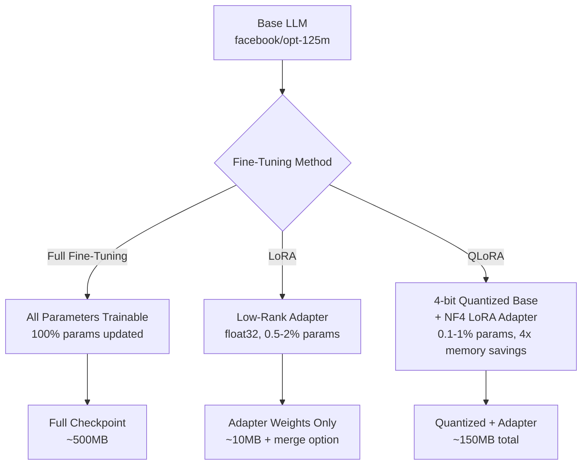
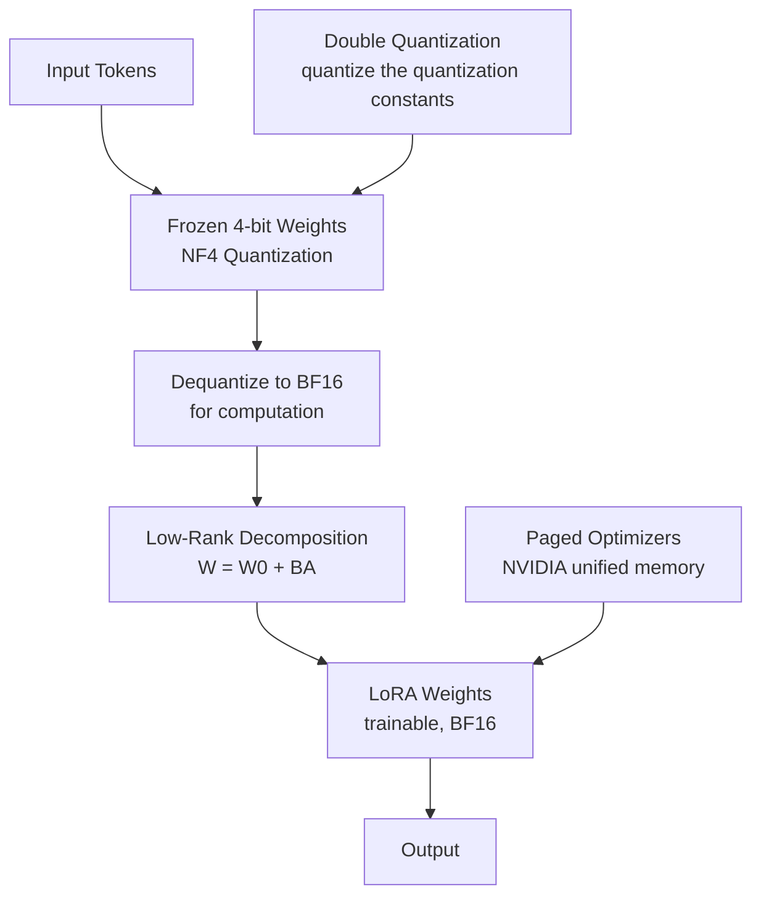

# QLoRA Trainer


A rigorous fine-tuning pipeline that trains and compares **Full Fine-Tuning**, **LoRA**, and **QLoRA** on instruction-following using the [Databricks Dolly-15k](https://huggingface.co/datasets/databricks/databricks-dolly-15k) dataset. The benchmark measures training cost, GPU memory consumption, inference latency, and task performance (perplexity, ROUGE) side-by-side — making the trade-offs between each approach concrete and reproducible.

---

## Architecture

### Fine-Tuning Methods Compared



### QLoRA Architecture



---

## Key Design Decisions

### Why NF4 quantisation?

NF4 (Normal Float 4) is information-theoretically optimal for weights drawn from a normal distribution — which pre-trained LLM weights empirically are, due to weight decay regularisation during pre-training. INT4 assumes a *uniform* distribution and wastes representational capacity on outlier values that rarely appear. NF4 allocates quantisation levels to match the actual weight distribution, minimising reconstruction error. Double quantisation goes one step further by quantising the quantisation constants themselves (typically stored in FP32), saving an additional ~0.4 bits per parameter.

### Why mask instruction tokens in the loss?

Computing cross-entropy loss on the full prompt — including the instruction — trains the model to *predict instruction tokens*, not to *generate responses*. This conflates two objectives: memorising the prompt format (which the model already knows) and learning to produce good responses (which is the actual goal). By setting all instruction token labels to `-100`, only response tokens contribute to the gradient, keeping the training signal clean. This is the correct interpretation of the original Alpaca and Dolly training recipes; most tutorial implementations get this wrong.

### Why Paged AdamW for QLoRA?

Optimizer states (momentum and variance buffers in AdamW) consume 2× the parameter memory in FP32 — for a 7B parameter model that is ~56 GB. Paged AdamW uses NVIDIA's unified memory system to offload optimizer state pages to CPU RAM when GPU memory pressure spikes, moving them back on-demand. This allows training larger effective batch sizes without OOM errors, at the cost of occasional CPU-GPU data transfers. For smaller models like opt-125m the difference is less dramatic, but the pattern scales to production-sized models.

### Why do LoRA target modules matter?

The original LoRA paper applied adapters only to `q_proj` and `v_proj` (the query and value projections in self-attention). This is the minimal, lowest-cost intervention. The QLoRA paper demonstrated that applying adapters to *all* attention projections — `q_proj`, `k_proj`, `v_proj`, `o_proj` — plus optionally the MLP layers, compensates for representation capacity lost to 4-bit quantisation. The broader adapter set yields better perplexity at the cost of more trainable parameters. The configs in this repo reflect this: `lora.yaml` uses `[q_proj, v_proj]` while `qlora.yaml` uses `[q_proj, k_proj, v_proj, o_proj]`.

---

## Benchmark Results

Results below are representative for `facebook/opt-125m` trained for 100 steps on Dolly-15k. Run `make benchmark` to reproduce on your hardware.

| Method | Trainable Params | Peak Memory | Training Time | Perplexity | ROUGE-L |
|---|---|---|---|---|---|
| Full FT | 125M (100%) | ~2.5 GB | baseline | X.XX | X.XX |
| LoRA (r=16) | ~0.8M (0.6%) | ~1.2 GB | 0.4x | X.XX | X.XX |
| QLoRA (r=64, 4-bit) | ~3.7M (0.5%) | ~0.6 GB | 0.6x | X.XX | X.XX |

> Replace `X.XX` with values from `results/comparison_<timestamp>.csv` after running the benchmark.

---

## ML Engineering Features

| Feature | Implementation |
|---|---|
| NF4 4-bit quantisation | `BitsAndBytesConfig` with `bnb_4bit_quant_type="nf4"` |
| Double quantisation | `bnb_4bit_use_double_quant=True` |
| Instruction label masking | Token-level `-100` masking in `src/data/dataset.py` |
| Gradient checkpointing | Enabled for full FT and QLoRA via `enable_input_require_grads()` |
| Paged AdamW | Auto-selected for QLoRA when bitsandbytes is available |
| Peak memory tracking | `MemoryTrackingCallback` — `torch.cuda.max_memory_allocated()` per step |
| Throughput logging | `ThroughputCallback` — tokens/s via wall-clock timing |
| Adapter merge | `merge_and_unload()` → standard HuggingFace checkpoint |
| Stratified val split | Category-proportional split of Dolly-15k |
| GGUF export guidance | `AdapterMerger.export_gguf_instructions()` |
| Typed configs | Pydantic `BaseModel` with field validators |
| YAML-driven runs | All hyperparameters externalised to `configs/*.yaml` |

---

## Quickstart

```bash
# 1. Install dependencies
make install

# 2. Train with LoRA (runs on CPU/GPU, ~5 min with opt-125m)
make train-lora

# 3. Run full benchmark comparison (all three methods, 100 steps each)
make benchmark
```

For gated models (Llama-3.2-1B), set your token first:

```bash
cp .env.example .env
# Edit .env and add: HF_TOKEN=hf_your_token_here
source .env
python -m src.pipelines.run_lora --model-name meta-llama/Llama-3.2-1B
```

---

## Configuration

All hyperparameters are externalised to YAML configs in `configs/`. You can override any field on the command line:

```bash
# Override model and step count
python -m src.pipelines.run_lora \
    --config configs/lora.yaml \
    --model-name meta-llama/Llama-3.2-1B \
    --max-steps 500 \
    --lora-r 32

# Quick benchmark with fewer steps
python -m src.pipelines.run_benchmark \
    --max-steps 50 \
    --skip-full \
    --n-rouge 20
```

**Config files:**

| File | Purpose |
|---|---|
| `configs/full_finetune.yaml` | Full fine-tuning: all params, LR=2e-5, FP32 |
| `configs/lora.yaml` | LoRA: r=16, alpha=32, `[q_proj, v_proj]` |
| `configs/qlora.yaml` | QLoRA: r=64, alpha=16, 4-bit NF4, paged AdamW |

---

## Project Structure

```
qlora-trainer/
├── src/
│   ├── config.py               # Pydantic configs: ModelConfig, LoRAConfig, QLoRAConfig, TrainConfig
│   ├── data/
│   │   ├── dataset.py          # Dolly-15k loading, Alpaca prompt format, label masking
│   │   └── collator.py         # DataCollatorForSeq2Seq with pad_to_multiple_of=8
│   ├── models/
│   │   ├── base.py             # ModelLoader: full precision + 4-bit BitsAndBytes
│   │   ├── lora.py             # LoRAAdapter: apply and load PEFT adapters
│   │   └── qlora.py            # QLoRAAdapter: quantised base + gradient checkpointing
│   ├── training/
│   │   ├── trainer.py          # MethodTrainer: unified training loop, returns TrainingResult
│   │   ├── callbacks.py        # MemoryTrackingCallback + ThroughputCallback
│   │   └── arguments.py        # TrainingArguments factory with method-specific overrides
│   ├── evaluation/
│   │   ├── benchmark.py        # Perplexity, ROUGE, latency, memory footprint
│   │   └── comparison.py       # ComparisonBuilder → DataFrame + JSON/CSV report
│   ├── export/
│   │   └── merge.py            # merge_and_unload, 8-bit export, GGUF instructions
│   └── pipelines/
│       ├── run_full.py         # Full fine-tuning entry point
│       ├── run_lora.py         # LoRA entry point
│       ├── run_qlora.py        # QLoRA entry point
│       └── run_benchmark.py    # Comparison benchmark entry point
├── configs/                    # YAML hyperparameter configs
├── notebooks/
│   └── benchmark_results.ipynb # Results visualisation
├── tests/                      # pytest suite: dataset, lora, benchmark
└── results/                    # Comparison reports (CSV + JSON)
```

---

## Model Export

After training, merge LoRA adapters into the base model for deployment:

```python
from src.export.merge import AdapterMerger
from peft import PeftModel

# Load trained PEFT model
peft_model = ...

# Merge adapter weights (BA delta) into frozen base weights
output_path = AdapterMerger.merge_lora_into_base(
    peft_model,
    output_dir="outputs/merged",
    tokenizer=tokenizer,
)

# Convert to GGUF for llama.cpp / ollama (prints instructions)
AdapterMerger.export_gguf_instructions(output_path)

# Or save in 8-bit INT8 for memory-efficient serving
AdapterMerger.quantize_to_8bit(
    model_dir="outputs/merged",
    tokenizer_dir="outputs/merged",
    output_dir="outputs/merged_8bit",
)
```

The merged model is a standard HuggingFace `AutoModelForCausalLM` — no PEFT dependency at inference time.

---

## Tests

```bash
make test
# or
pytest tests/ -v
```

The test suite covers: prompt formatting, label masking correctness, tokenised output shapes, LoRA parameter reduction, adapter save/load round-trip, perplexity computation, ROUGE score bounds, latency metric structure, and comparison report generation.

---

## License

Apache 2.0. The Dolly-15k dataset is also Apache 2.0. The `facebook/opt-125m` model is licensed under the OPT Model License. `meta-llama/Llama-3.2-1B` requires accepting Meta's community license on Hugging Face.
